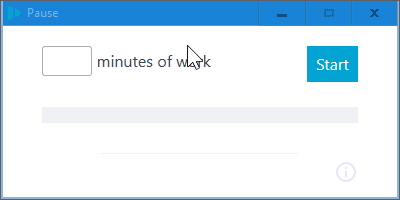

# Pause

[This](https://github.com/Thomsch/pause) Electron app, remade with Sciter.

## Preview

## Instructions

On Windows, download [scapp.exe](https://github.com/c-smile/sciter-sdk/blob/master/bin.win/x32/scapp.exe), place it inside this folder, and run it.

The corresponding binaries for Mac and Linux can be found in `bin.osx` and `bin.lnx`, respectively.